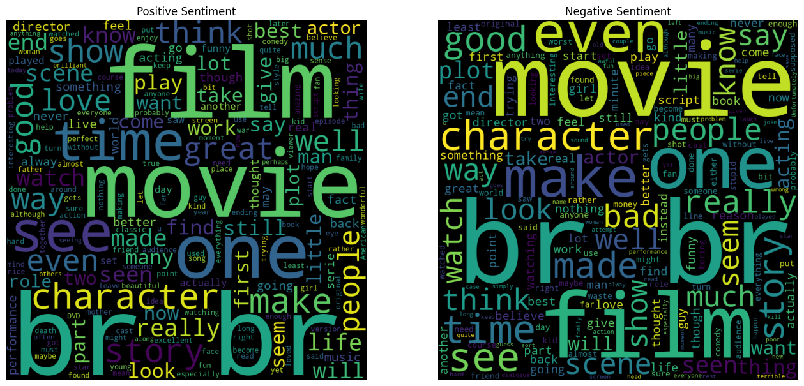

# Movie Reviews Sentiment Analysis
The objective of this project is to determine the underlying sentiment in a text, in this case, by classifying user reviews of movies as positive or negative. 
To achieve this, various natural language processing and machine learning techniques have been applied to a pre-labeled dataset from <a href="https://www.kaggle.com/datasets/lakshmi25npathi/imdb-dataset-of-50k-movie-reviews/data">Kaggle</a>. 
The results obtained are presented below, and the main conclusions are discussed.

## Text cleaning
Below is the Python code used to extract the data from Kaggle and store it in the variable `data`:

```python
import pandas as pd

data=pd.read_csv("IMDB Dataset.csv")
```
We can then utilize the function `show_word_clouds` to visualize the most frequent words used in positive and negative reviews separately, as illustrated in `Figure 1`.

```python
from wordcloud import WordCloud

def show_word_clouds(data, stopwords=None):
    '''
    Input:
        data: Pandas DataFrame containing reviews and their sentiment evaluation.
        stopwords: Words that, being very common and/or uninformative, will not be considered when generating the word cloud.
    '''
    
    # Extract positive and negative reviews
    pos = ' '.join(map(str, data['review'][data['sentiment'] == 'positive']))
    neg = ' '.join(map(str, data['review'][data['sentiment'] == 'negative']))

    # Generate word clouds for positive and negative sentiments
    positive_cloud = WordCloud(width=800, height=800, 
                               background_color='black', 
                               stopwords=stopwords, 
                               min_font_size=10).generate(pos) 
    
    negative_cloud = WordCloud(width=800, height=800, 
                               background_color='black', 
                               stopwords=stopwords, 
                               min_font_size=10).generate(neg) 

    # Display the word clouds
    plt.figure(figsize=(16, 8))
    plt.subplot(1, 2, 1)
    plt.imshow(positive_cloud)
    plt.title('Positive Sentiment')
    plt.axis('off')
    plt.subplot(1, 2, 2)
    plt.imshow(negative_cloud)
    plt.title('Negative Sentiment')
    plt.axis('off')

show_word_clouds(data)
```
### Figure 1: Word Clouds for Positive and Negative Reviews

<table>
  <tr>
    <td></td>
  </tr>
</table>

At first glance, there doesn't appear to be a strong correlation between the words in the word cloud and the sentiment of the reviews. However, it's noticeable that the word cloud contains HTML elements such as 'br' tags, indicating the presence of HTML formatting within the reviews. Therefore, it's important to preprocess the data appropriately and remove HTML tags to ensure accurate analysis. For that reason the function `simple_preprocessor` was created, which removes HTML tags, non-word characters, and converts the text to lowercase. 

```python
import re

def simple_preprocessor(text):
    text = re.sub('<.*?>', '', text)      # Remove HTML tags
    text = re.sub('[\W]+', ' ', text)     # Remove non-word characters
    text = text.lower()                   # Convert text to lowercase
    return text

data_clean = data.copy()  # Copying to avoid modifying the original
data_clean["review"] = data["review"].apply(simple_preprocessor)  # Applying the preprocessing to each row
```
## Splitting Data into Training and Testing Sets

After preprocessing, now with the cleaned data, it will be split into the train and test sets for model training and testing.  In this configuration, the first 35,000 reviews will be used for training, while the remaining 15,000 will be used for testing.

```python
data_train=data_clean[:35000]
data_test=data_clean[35000:]
```
## Pipeline Configuration

Four distinct pipelines are built, each designed to explore different preprocessing techniques and feature representations before applying a logistic regression classifier. The pipelines are defined as follows:

Pipeline 1: Utilizes a basic CountVectorizer to convert text data into token counts, followed by standard scaling of features and logistic regression for classification.

Pipeline 2: Extends Pipeline 1 by incorporating stop words removal during tokenization with CountVectorizer to improve feature representation.

Pipeline 3: Integrates a Term Frequency-Inverse Document Frequency (TF-IDF) transformation alongside CountVectorizer to enhance feature representation for logistic regression.

Pipeline 4: Utilizes CountVectorizer with a specific n-gram range of (2, 2) to capture word pairs as features, combined with standard scaling and logistic regression.

```python
from sklearn.pipeline import make_pipeline
from sklearn.feature_extraction.text import CountVectorizer
from sklearn.preprocessing import StandardScaler
from sklearn.linear_model import LogisticRegression
from sklearn.feature_extraction.text import TfidfTransformer

pipeline_1 = make_pipeline(CountVectorizer(preprocessor=simple_preprocessor), StandardScaler(with_mean=False), LogisticRegression())
pipeline_1.fit(data_train["review"], data_train["sentiment"])

pipeline_2 = make_pipeline(CountVectorizer(preprocessor=simple_preprocessor, stop_words=stop_words), StandardScaler(with_mean=False), LogisticRegression())
pipeline_2.fit(data_train["review"], data_train["sentiment"])

pipeline_3 = make_pipeline(CountVectorizer(preprocessor=simple_preprocessor), TfidfTransformer(), LogisticRegression())
pipeline_3.fit(data_train["review"], data_train["sentiment"])

pipeline_4 = make_pipeline(CountVectorizer(preprocessor=simple_preprocessor, ngram_range=(2, 2)), StandardScaler(with_mean=False), LogisticRegression())
pipeline_4.fit(data_train["review"], data_train["sentiment"])
```
